# 🏛️ **AURELIAN'S CLOSET** 🏛️

### *Precision Outfit Generation with Structured Visual Control*

---

> *"Patterns You Don't Notice. Style That Understands You."*


---

## 🔮 **The Vision**

**Aurelian's Closet** is not just a fashion app. It is a **trojan horse for cognitive health monitoring**, wrapped in the most elegant, high-precision personal styling experience ever built.

By leveraging **Gemini 2.5 Flash** for structured JSON generation (The **FIBO Engine**), we create a platform where every visual parameter—from fabric texture to lighting angle—is controlled with mathematical precision.

But underneath the velvet and silk lies the **Hidden Layer**: a neuro-aesthetic engine that analyzes your style choices over time to detect subtle shifts in cognitive flexibility, sensory sensitivity, and executive function.

---

<details open>
<summary><h2>✨ 1. The Surface: Hyper-Realistic Fashion</h2></summary>

### **Elegance Through Precision**
Users engage with a beautiful, dark-mode interface to curate their existence.

*   **Virtual Wardrobe**: Generate items that don't exist yet.
*   **Context Aware**: Weather, Occasion, and Mood influence the generation.
*   **Visual Matrix**: See the raw "Code of Fashion" (JSON) alongside the render.

### **The FIBO Engine**
We don't just ask for "a nice dress". We construct a **Structured Visual Matrix** using Gemini 2.5 Flash's strictly typed JSON mode:

```json
{
  "outfit": {
    "occasion": "evening_gala",
    "texture_layers": [
      {"material": "silk_charmeuse", "weight": "light", "sheen": 0.85}
    ],
    "camera": {
      "angle": "low_angle_hero",
      "lighting": "rembrandt_contrast"
    }
  }
}
```


</details>

---

## 🏗️ **System Architecture**

We utilize a **Bi-Modal Generation Pipeline** where structured logic meets creative diffusion.

```mermaid
graph TD
    style User fill:#1a1a1a,stroke:#d4af37,stroke-width:2px,color:#fff
    style FIBO fill:#2c3e50,stroke:#d4af37,stroke-width:2px,color:#fff
    style Gen fill:#2c3e50,stroke:#d4af37,stroke-width:2px,color:#fff
    style Hidden fill:#4a0e0e,stroke:#ff5252,stroke-width:2px,color:#fff

    User((👤 User Input)) -->|Mood, Occasion| FIBO{Gemini 2.5 Flash}
    FIBO -->|Structured JSON Spec| Matrix[FIBO Matrix]
    Matrix -->|Prompt Engineering| Gen[Gemini Image Gen]
    Gen -->|Photorealistic Render| UI[App Interface]
    
    subgraph "The Hidden Layer"
    Matrix -->|Historical Data| Hidden{Neuro-Aesthetic Engine}
    Hidden -->|Pattern Recognition| Analysis[Cognitive Health Report]
    end
```



---

<details>
<summary><h2>🧠 2. The Hidden Layer: Cognitive Monitoring</h2></summary>

### **The Revelation**
While the user focuses on looking good, **Aurelian's Closet** is looking *at* them.

> **"Every choice tells a story."**

We track parameters that correlate with neurological states:
*   📉 **Rigidity**: Are color palettes becoming increasingly monochromatic? (Depression/Anxiety markers)
*   🧶 **Sensory Sensitivity**: Is there an avoidance of complex textures? (Sensory processing shifts)
*   🧩 **Executive Coherence**: How complex are the layering combinations? (Cognitive decline markers)

### **The Dashboard**
Accessible only via a specific toggle, the "System View" reveals the E2E encrypted health data derived purely from aesthetic choices.

</details>

---

## 🔄 **Data Flow & Logic**

How the system translates vague user desires into medical-grade insights.


---

<details>
<summary><h2>🛠️ 3. Technical Implementation</h2></summary>

### **Tech Stack**
*   **Frontend**: React 19, TailwindCSS, Lucide Icons
*   **AI Orchestration**: Google GenAI SDK (`@google/genai`)
*   **Visualization**: Recharts (for the Radar/Health data)
*   **Typography**: Inter, JetBrains Mono, Cinzel

### **Key Components**
1.  `geminiService.ts`: Handles the multi-step reasoning. First prompts for JSON, then prompts for Image.
2.  `HiddenLayer.tsx`: The secret component that renders the health data.
3.  `JsonViewer.tsx`: A cyberpunk-style component to visualize the raw FIBO data.

</details>

---

## 🧬 **FIBO Pattern Structure**

The underlying data model that powers the entire ecosystem.


---

## 🚀 **Getting Started**

1.  **Clone the Repository**
    ```bash
    git clone https://github.com/senushidinara/aurelians-closet.git
    ```

2.  **Install Dependencies**
    ```bash
    npm install
    ```

3.  **Set API Key**
    ```bash
    export API_KEY="your_gemini_api_key"
    ```

4.  **Run the Experience**
    ```bash
    npm start
    ```

---

## 🏆 **Why This **

| Feature | Description | Impact |
| :--- | :--- | :--- |
| **FIBO Control** | Native JSON generation | Perfect consistency in output |
| **Hidden Layer** | Neuroscience integration | Solves passive health monitoring |
| **UX/UI** | Luxury aesthetic | High user retention |

---

<p align="center">
  <i>"In the details of the fabric, we find the threads of the mind."</i>
  <br>
  <b>Aurelian's Closet 2025</b>
</p>
